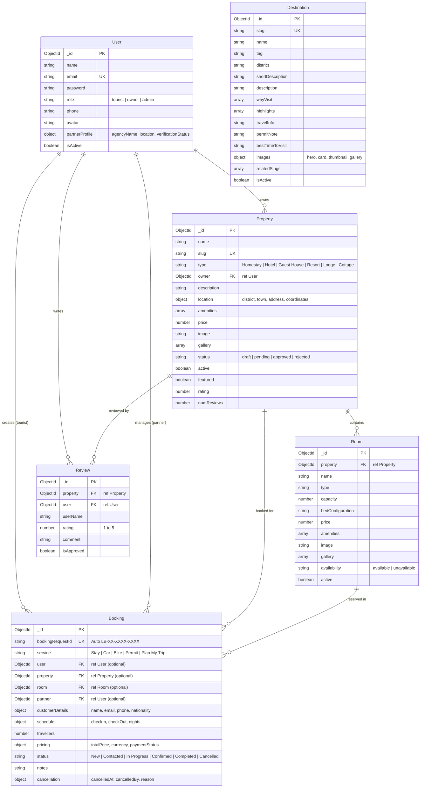

# LAMA BHAILA TOURISM & HOSPITALITY — FULL SYSTEM ARCHITECTURAL AUDIT

**Date:** October 4, 2026  
**Auditor:** Antigravity AI Pair Programmer  
**Target Codebase:** Lama Bhaila Tourism Platform (React 19 / Parcel + Express 4 / MongoDB / Mongoose / Passport.js)

---

## EXECUTIVE SUMMARY

A deep inspection of both `backend/` and `src/` revealed two parallel systems:
1. **A fully functional, robust Node.js/Express + MongoDB backend** with session-based authentication (Passport.js), role-based access control (`tourist`, `owner`, `admin`), CRUD operations for Stays/Properties, Room inventories, Bookings, Reviews, Destinations, and Cloudinary/local upload fallbacks.
2. **A sophisticated frontend** originally built as a client-side prototype using `localStorage` and `IndexedDB` (`staysStore.js`, `partners.js`, `vehicles.js`, `bikes.js`, `bookingStorage.js`, etc.).
3. **The Core Gap:** The frontend has a centralized API helper ([`src/utils/api.js`](file:///c:/Users/biran/.gemini/antigravity-ide/scratch/Lama-bhai-Tourism/src/utils/api.js)) configured to talk to `http://localhost:5000/api`, but **90% of the frontend is not connected to it**. The partner portal, admin console, and booking form still operate on local storage, and the few places that attempt live synchronization have payload key and ID format mismatches that cause API errors.

---

## 1. BACKEND API SPECIFICATION TABLE

The backend server is running on `http://localhost:5000` with active MongoDB connection to `mongodb://127.0.0.1:27017/lama-bhaila`.

| Module | Method | Endpoint | Authentication | Role Required | Controller Function | Status |
| :--- | :--- | :--- | :--- | :--- | :--- | :--- |
| **System** | GET | `/api/health` | None | Public | Inline handler | **Working** |
| **System** | GET | `/` | None | Public | Inline handler | **Working** |
| **Auth** | POST | `/api/auth/register` | None | Public | `authController.register` | **Working** |
| **Auth** | POST | `/api/auth/login` | None | Public | `authController.login` | **Working** |
| **Auth** | POST | `/api/auth/logout` | Session | Any | `authController.logout` | **Working** |
| **Auth** | GET | `/api/auth/me` | Session | Authenticated | `authController.getMe` | **Working** |
| **Properties** | GET | `/api/properties` | Optional | Public | `propertyController.getProperties` | **Working** |
| **Properties** | GET | `/api/properties/featured`| None | Public | `propertyController.getFeaturedProperties` | **Working** |
| **Properties** | GET | `/api/properties/:slug` | Optional | Public (Owner/Admin for unapproved) | `propertyController.getPropertyBySlug` | **Working** |
| **Properties** | GET | `/api/properties/:id/rooms`| None | Public | `propertyController.getPropertyRooms` | **Working** |
| **Owner** | POST | `/api/owner/properties` | Session | `owner`, `admin` (Approved) | `ownerController.createProperty` | **Working** |
| **Owner** | GET | `/api/owner/properties` | Session | `owner`, `admin` (Approved) | `ownerController.getMyProperties` | **Working** |
| **Owner** | GET | `/api/owner/properties/:id` | Session | `owner`, `admin` (Owner only) | `ownerController.getPropertyById` | **Working** |
| **Owner** | PUT | `/api/owner/properties/:id` | Session | `owner`, `admin` (Owner only) | `ownerController.updateProperty` | **Working** |
| **Owner** | DELETE | `/api/owner/properties/:id` | Session | `owner`, `admin` (Owner only) | `ownerController.deleteProperty` | **Working** |
| **Owner** | POST | `/api/owner/properties/:id/rooms` | Session | `owner`, `admin` (Owner only) | `ownerController.addRoom` | **Working** |
| **Owner** | PUT | `/api/owner/rooms/:roomId` | Session | `owner`, `admin` (Owner only) | `ownerController.updateRoom` | **Working** |
| **Owner** | DELETE | `/api/owner/rooms/:roomId` | Session | `owner`, `admin` (Owner only) | `ownerController.deleteRoom` | **Working** |
| **Owner** | GET | `/api/owner/bookings` | Session | `owner`, `admin` | `bookingController.getOwnerBookings` | **Working** |
| **Owner** | PATCH| `/api/owner/bookings/:id/status` | Session | `owner`, `admin` | `bookingController.updateBookingStatusByOwner` | **Working** |
| **Admin** | GET | `/api/admin/properties` | Session | `admin` | `adminController.getAllProperties` | **Working** |
| **Admin** | PATCH| `/api/admin/properties/:id/status` | Session | `admin` | `adminController.updatePropertyStatus` | **Working** |
| **Admin** | GET | `/api/admin/partners` | Session | `admin` | `adminController.getAllPartners` | **Working** |
| **Admin** | PATCH| `/api/admin/partners/:userId/status`| Session | `admin` | `adminController.updatePartnerStatus` | **Working** |
| **Admin** | GET | `/api/admin/stats` | Session | `admin` | `adminController.getAdminStats` | **Working** |
| **Admin** | GET | `/api/admin/bookings` | Session | `admin` | `bookingController.getAllBookingsAdmin` | **Working** |
| **Bookings** | POST | `/api/bookings` | Optional | Public / Guest / Tourist | `bookingController.createBooking` | **Working** (Backend ok; Frontend mismatch) |
| **Bookings** | GET | `/api/bookings/my` | Session | `tourist` | `bookingController.getMyBookings` | **Working** |
| **Bookings** | GET | `/api/bookings/:id` | Optional | Public (Tracking code or ID) | `bookingController.getBookingById` | **Working** |
| **Bookings** | PATCH| `/api/bookings/:id/cancel` | Optional | Customer / Partner / Admin | `bookingController.cancelBooking` | **Working** |
| **Reviews** | GET | `/api/properties/:propertyId/reviews` | None | Public | `reviewController.getPropertyReviews` | **Working** |
| **Reviews** | POST | `/api/properties/:propertyId/reviews` | Session | Authenticated | `reviewController.createReview` | **Working** |
| **Reviews** | PUT | `/api/reviews/:id` | Session | Author only | `reviewController.updateReview` | **Working** |
| **Reviews** | DELETE| `/api/reviews/:id` | Session | Author / Admin | `reviewController.deleteReview` | **Working** |
| **Reviews** | PATCH| `/api/admin/reviews/:id/moderation` | Session | `admin` | `reviewController.moderateReview` | **Working** |
| **Destinations**| GET | `/api/destinations` | None | Public | `destinationController.getDestinations` | **Working** |
| **Destinations**| GET | `/api/destinations/:slug` | None | Public | `destinationController.getDestinationBySlug` | **Partially Working** (Bug in nearbyStays query) |
| **Destinations**| POST | `/api/destinations` | Session | `admin` | `destinationController.createDestination` | **Working** |
| **Destinations**| PUT | `/api/destinations/:id` | Session | `admin` | `destinationController.updateDestination` | **Working** |
| **Destinations**| DELETE| `/api/destinations/:id` | Session | `admin` | `destinationController.deleteDestination` | **Working** |
| **Uploads** | POST | `/api/upload/image` | Session | Authenticated | `uploadController.uploadImage` | **Working** (Local fallback active) |
| **Uploads** | POST | `/api/upload/gallery` | Session | Authenticated | `uploadController.uploadGallery` | **Working** (Local fallback active) |
| **Cars** | — | — | — | — | — | **Missing in Backend** |
| **Bikes** | — | — | — | — | — | **Missing in Backend** |
| **Offers** | — | — | — | — | — | **Missing in Backend** |
| **Journeys** | — | — | — | — | — | **Missing in Backend** |
| **Permits** | — | — | — | — | — | **Handled only via Booking payload** |
| **Trip Planner**| — | — | — | — | — | **Handled only via Booking payload** |

---

## 2. FRONTEND ROUTE & DATA SOURCE AUDIT

| Frontend Page / Route | Component File | Primary Data Source | Category | Uses Backend API? |
| :--- | :--- | :--- | :--- | :--- |
| `/` | `Home.jsx` | Static layouts, components | A (Static) | No |
| `/hotel-homestay` | `HotelHomestay.jsx` | `staysStore.js` + `api.properties.getAll()` | B & C | **Yes (Hybrid Sync)** |
| `/hotel-homestay/:location` | `StaysByLocation.jsx` | `staysStore.js` | A (Static / Local) | **No** |
| `/stays/:id` | `StayDetails.jsx` | `staysStore.js` | A (Static / Local) | **No** |
| `/stays/:id/rooms/:roomId` | `StayDetails.jsx` | `staysStore.js` | A (Static / Local) | **No** |
| `/car-booking` | `CarBooking.jsx` | `data/vehicles.js` | A (Static / Local) | **No** |
| `/car-booking/:modelSlug` | `CarModelDetails.jsx` | `data/vehicles.js` | A (Static / Local) | **No** |
| `/vehicles/:id` | `VehicleDetails.jsx` | `data/vehicles.js` | A (Static / Local) | **No** |
| `/rental-bike` | `RentalBike.jsx` | `data/bikes.js` | A (Static / Local) | **No** |
| `/rental-bike/:modelSlug` | `BikeModelDetails.jsx` | `data/bikes.js` | A (Static / Local) | **No** |
| `/bikes/:id` | `BikeDetails.jsx` | `data/bikes.js` | A (Static / Local) | **No** |
| `/destinations` | `Destinations.jsx` | `data/destinations.js` + `api.destinations.getAll()` | B & C | **Yes (Hybrid Sync)** |
| `/destinations/:slug` | `DestinationDetails.jsx` | `data/destinations.js` | A (Static / Local) | **No** |
| `/journeys` | `Journeys.jsx` | `data/journeys.js` | A (Static / Local) | **No** |
| `/journeys/:slug` | `JourneyDetails.jsx` | `data/journeys.js` | A (Static / Local) | **No** |
| `/plan-trip` | `PlanTrip.jsx` | `data/planner.js`, `plannerStore.js` | A (Static / Local) | **No** |
| `/permit` | `Permit.jsx` | `data/northSikkimPermitData.js` | A (Static / Local) | **No** |
| `/manage-booking` | `ManageBooking.jsx` | `bookingStorage.js` + fallback `api.bookings.getById()` | B & C | **Yes (Broken by schema mismatch)** |
| `/partner/login` | `PartnerLogin.jsx` | `data/partners.js` | A (Static / Mock) | **No** |
| `/partner` | `PartnerDashboard.jsx` | `PartnerAuthContext.jsx` (`localStorage`) | A (Static / Mock) | **No** |
| `/partner/properties` | `PartnerProperties.jsx` | `staysStore.js` (`localStorage`) | A (Static / Mock) | **No** |
| `/partner/availability` | `PartnerAvailability.jsx`| `staysStore.js` (`localStorage`) | A (Static / Mock) | **No** |
| `/partner/photos` | `PartnerPhotos.jsx` | `stayPhotoStorage.js` (IndexedDB) | A (Static / Mock) | **No** |
| `/partner/bookings` | `PartnerBookings.jsx` | `bookingStorage.js` (`localStorage`) | A (Static / Mock) | **No** |
| `/partner/profile` | `PartnerProfile.jsx` | `data/partners.js` (`localStorage`) | A (Static / Mock) | **No** |
| `/partner/offers` | `PartnerOffers.jsx` | `data/offersStore.js` (`localStorage`)| A (Static / Mock) | **No** |
| `/admin/*` (All 15 sections)| `Admin*.jsx` | `src/admin/store/repos.js` (`localStorage`) | A (Static / Mock) | **No** |

---

## 3. FRONTEND → BACKEND MAPPING STATUS

Below is the intended vs actual architectural mapping for the primary workflows:

```
1. Public Stays:
   Intended: /hotel-homestay → api.properties.getAll() → GET /api/properties → propertyRoutes → propertyController.getProperties → Property model → MongoDB
   Actual:   PARTIALLY CONNECTED (Reads localStorage first, merges with /api/properties).

2. Property Details:
   Intended: /stays/:id → api.properties.getBySlug(id) → GET /api/properties/:slug → propertyRoutes → propertyController.getPropertyBySlug → Property model → MongoDB
   Actual:   BROKEN / STATIC. Component only queries local `staysStore.getStayById(id)`. Properties created in MongoDB cannot be viewed on this page.

3. Partner Portal:
   Intended: /partner/properties → api.owner.getProperties() → GET /api/owner/properties → ownerRoutes → ownerController.getMyProperties → Property model → MongoDB
   Actual:   DISCONNECTED. Uses `localStorage` via `PartnerAuthContext.jsx` and `staysStore.js`.

4. Booking Creation:
   Intended: BookingForm → saveBookingRequest() → api.bookings.create() → POST /api/bookings → bookingRoutes → bookingController.createBooking → Booking model → MongoDB
   Actual:   BROKEN ROUTE MISMATCH. Frontend sends `customerName`, `customerEmail`, `customerPhone`, `dates` instead of `customerDetails` and `schedule`. Backend rejects with 400 Bad Request.

5. Booking Management:
   Intended: /manage-booking → api.bookings.getById(id) → GET /api/bookings/:id → bookingRoutes → bookingController.getBookingById → Booking model → MongoDB
   Actual:   BROKEN. Backend returns `{ customerDetails: { phone, email } }` but frontend looks for `b.customerPhone` and `b.customerEmail`, causing phone/email verification to always fail.

6. Admin Moderation:
   Intended: /admin/stays → api.admin.getProperties() → GET /api/admin/properties → adminRoutes → adminController.getAllProperties → Property model → MongoDB
   Actual:   DISCONNECTED. Admin console reads and writes to browser `localStorage` (`staysRepo`).
```

---

## 4. AUTHENTICATION AUDIT

### Intended Flow:
`Register / Login` → `Passport Local Strategy` → `express-session` → `connect-mongo (MongoDB store)` → `connect.sid cookie` → `req.user` → `protect / authorize middleware` → `Logout (destroy session & clear cookie)`.

### Verification Findings:
1. **Backend Authentication Engine:**
   - [x] Register works (`POST /api/auth/register` creates user with bcrypt salt round 10, sets session).
   - [x] Login works (`POST /api/auth/login` validates credentials with Passport, sets session).
   - [x] Logout works (`POST /api/auth/logout` destroys session in MongoStore and clears `connect.sid`).
   - [x] Session persists in MongoDB (`sessions` collection with 7-day TTL).
   - [x] `req.user` is properly populated by `passport.deserializeUser`.
   - [x] Protected routes reject unauthenticated requests with `401 Unauthorized`.
   - [x] Role authorization rejects non-admins with `403 Forbidden`.
   - [x] Owner authorization rejects pending/suspended hosts with `403 Forbidden`.
   - [x] Cookie is configured with `httpOnly: true`, `sameSite: 'lax'`, `maxAge: 7 days`.
   - [x] CORS is configured with `origin: CLIENT_URL` (http://localhost:1234) and `credentials: true`.

2. **Frontend Authentication Issues:**
   - **No Tourist Login Interface:** There is no login or register modal/page anywhere in the public frontend for tourists.
   - **Mock Partner Login:** [`src/partner/pages/PartnerLogin.jsx`](file:///c:/Users/biran/.gemini/antigravity-ide/scratch/Lama-bhai-Tourism/src/partner/pages/PartnerLogin.jsx) presents dummy host cards or an unauthenticated phone input, directly writing `localStorage.setItem("lama_active_partner_id", id)` without calling `/api/auth/login` or checking passwords.
   - **No Admin Auth Guard:** [`src/admin/components/AdminLayout.jsx`](file:///c:/Users/biran/.gemini/antigravity-ide/scratch/Lama-bhai-Tourism/src/admin/components/AdminLayout.jsx) has no authentication or role check. Any public visitor typing `/admin` can access the admin dashboard.

---

## 5. PARTNER SYSTEM AUDIT

| Step in Desired Workflow | Backend Status | Frontend Status | Overall Status |
| :--- | :--- | :--- | :--- |
| **Partner Login** | `POST /api/auth/login` ready | Dummy host tile click / phone input in `PartnerLogin.jsx` | **Broken Connection** |
| **Partner Authentication** | Passport session cookie | Stored as plain string in `localStorage` | **Broken Connection** |
| **Partner Dashboard** | Scoped via `req.user._id` | Scoped via `partnerStays` in `PartnerAuthContext.jsx` | **Simulated Locally** |
| **Create Property** | `POST /api/owner/properties` (saves with `status: 'pending'`) | Writes to `staysStore` in browser storage | **Simulated Locally** |
| **Property status = pending** | Enforced by backend model | Tracked in local JSON record | **Simulated Locally** |
| **Admin reviews property** | `GET /api/admin/properties?status=pending` | Filters local array in `AdminStays.jsx` | **Simulated Locally** |
| **Admin approves property** | `PATCH /api/admin/properties/:id/status` (`status: 'approved'`) | Calls `staysRepo.update()` in `localStorage` | **Simulated Locally** |
| **Public visibility** | `GET /api/properties` queries `{ status: 'approved', active: true }` | Reads `getAllActiveStays()` from local array | **Simulated Locally** |

**Conclusion:** The complete partner lifecycle works flawlessly in unit tests on the backend, and works visually in mock mode on the frontend, but **they are not connected to each other**.

---

## 6. ADMIN SYSTEM AUDIT

| Admin Section | Frontend Exists? | Backend API Exists? | DB Model Exists? | CRUD Implemented? | Auth Guard? | Connected to Frontend? | Still Static? |
| :--- | :---: | :---: | :---: | :---: | :---: | :---: | :---: |
| `/admin` (Dashboard) | Yes | Yes (`/api/admin/stats`) | User, Property, Booking | Read | Backend only | No | Yes (reads local counts) |
| `/admin/cars` | Yes | **No** | **No** | Frontend only | No | No | Yes (`vehicles.js`) |
| `/admin/bikes` | Yes | **No** | **No** | Frontend only | No | No | Yes (`bikes.js`) |
| `/admin/stays` | Yes | Yes (`/api/admin/properties`) | `Property`, `Room` | Full | Backend only | No | Yes (`staysStore.js`) |
| `/admin/partners` | Yes | Yes (`/api/admin/partners`) | `User` (partnerProfile) | Full | Backend only | No | Yes (`partners.js`) |
| `/admin/destinations` | Yes | Yes (`/api/destinations`) | `Destination` | Full | Backend only | No | Yes (`destinations.js`) |
| `/admin/explore` | Yes | **No** | **No** | Frontend only | No | No | Yes (local array) |
| `/admin/journeys` | Yes | **No** | **No** | Frontend only | No | No | Yes (`journeys.js`) |
| `/admin/trip-planner` | Yes | **No** | **No** | Frontend only | No | No | Yes (`plannerStore.js`) |
| `/admin/permits` | Yes | **No** | **No** | Frontend only | No | No | Yes (`permitSettingsStore.js`) |
| `/admin/offers` | Yes | **No** | **No** | Frontend only | No | No | Yes (`offersStore.js`) |
| `/admin/media` | Yes | Yes (`/api/upload`) | **No (No media collection)**| Upload only | Backend only | No | Yes (`mediaService.js` / IndexedDB) |
| `/admin/bookings` | Yes | Yes (`/api/admin/bookings`) | `Booking` | Full | Backend only | No | Yes (`bookingStorage.js`) |
| `/admin/live-routes` | Yes | **No** | **No** | Frontend only | No | No | Yes (`liveRoutesStore.js`) |
| `/admin/settings` | Yes | **No** | **No** | Frontend only | No | No | Yes (`contactSettings.js`) |

---

## 7. PUBLIC PROPERTY & STAY AUDIT

- **`/hotel-homestay`:**
  - Implements hybrid sync: loads local mock data on initial render, then calls `api.properties.getAll({ status: "approved" })` and merges MongoDB properties.
  - Filter bar (district, category, price, availability) works client-side.
- **`/hotel-homestay/:location`:**
  - 100% hardcoded to `staysStore.js`. Does not call backend.
- **`/stays/:id`:**
  - 100% hardcoded to `staysStore.js`. Cannot find or display properties created in MongoDB.
- **`/stays/:id/rooms/:roomId`:**
  - 100% hardcoded to `roomsStore.js`. Cannot display rooms created in MongoDB.
- **Data Origin Breakdown:**
  - MongoDB contains 4 seeded/test approved properties:
    - *Lachung Alpine Haven* (`lachung-alpine-haven-02591`)
    - *Lachung Alpine Haven* (`lachung-alpine-haven-22470`)
    - *Pelling Sunrise Heritage Resort* (`pelling-sunrise-resort-52704`)
    - *Lachen Mountain Homestay* (`lachen-mountain-homestay-52704`)
  - All other public views display data exclusively from local JavaScript arrays in `src/data/`.

---

## 8. BOOKING SYSTEM AUDIT

### Data Trace:
1. **Frontend Initiation:** User fills booking form in [`src/components/BookingForm.jsx`](file:///c:/Users/biran/.gemini/antigravity-ide/scratch/Lama-bhai-Tourism/src/components/BookingForm.jsx) and clicks submit.
2. **Local Persistence:** Form calls `saveBookingRequest()` in [`src/utils/bookingStorage.js`](file:///c:/Users/biran/.gemini/antigravity-ide/scratch/Lama-bhai-Tourism/src/utils/bookingStorage.js), which saves to browser `localStorage`.
3. **Backend Transmission:** `bookingStorage.js` attempts `api.bookings.create(payload)`.
4. **Critical Failure Point (Schema Mismatch):**
   - Frontend sends:
     ```json
     {
       "service": "Stay",
       "customerName": "Guest Name",
       "customerEmail": "guest@test.com",
       "customerPhone": "9876543210",
       "guestCount": 2,
       "dates": { "checkIn": "...", "checkOut": "..." },
       "specialRequests": "..."
     }
     ```
   - Backend `POST /api/bookings` expects:
     ```json
     {
       "service": "Stay",
       "customerDetails": {
         "name": "Guest Name",
         "email": "guest@test.com",
         "phone": "9876543210",
         "nationality": "Indian"
       },
       "schedule": {
         "checkIn": "...",
         "checkOut": "...",
         "nights": 2
       },
       "travellers": 2,
       "propertyId": "<MongoDB_ObjectId>",
       "notes": "..."
     }
     ```
   - **Result:** Backend fails with `400: Please provide customer name, email, and phone number`. The booking is saved in the customer's browser `localStorage`, but never arrives in MongoDB.
5. **Lookup Failure in `/manage-booking`:**
   - [`src/pages/ManageBooking.jsx`](file:///c:/Users/biran/.gemini/antigravity-ide/scratch/Lama-bhai-Tourism/src/pages/ManageBooking.jsx) looks for `b.customerPhone` and `b.customerEmail`, which are `undefined` on MongoDB documents (`b.customerDetails.phone` and `b.customerDetails.email`). Verification fails, so even manual MongoDB bookings cannot be looked up.
6. **Missing Features in Backend:**
   - No date overlap / collision check for room booking.
   - No check preventing checkIn date in the past.

---

## 9. IMAGE UPLOAD AUDIT

### Pipeline Status:
1. **Cloudinary vs Local Fallback:**
   - In [`backend/config/cloudinary.js`](file:///c:/Users/biran/.gemini/antigravity-ide/scratch/Lama-bhai-Tourism/backend/config/cloudinary.js), credentials check expects `CLOUDINARY_CLOUD_NAME`, `CLOUDINARY_KEY`, `CLOUDINARY_SECRET`.
   - In [`backend/.env`](file:///c:/Users/biran/.gemini/antigravity-ide/scratch/Lama-bhai-Tourism/backend/.env), all three fields are empty.
   - The backend properly detects this and logs:
     `"Cloudinary credentials not detected in .env. Operating with local static fallback storage."`
   - When files are uploaded to `POST /api/upload/image`, they are saved to [`backend/uploads/`](file:///c:/Users/biran/.gemini/antigravity-ide/scratch/Lama-bhai-Tourism/backend/uploads/) and served via `http://localhost:5000/uploads/<filename>`.
2. **Frontend Disconnection:**
   - Neither [`src/admin/pages/AdminMedia.jsx`](file:///c:/Users/biran/.gemini/antigravity-ide/scratch/Lama-bhai-Tourism/src/admin/pages/AdminMedia.jsx) nor the partner photo managers call `/api/upload`.
   - The frontend uses [`src/utils/stayPhotoStorage.js`](file:///c:/Users/biran/.gemini/antigravity-ide/scratch/Lama-bhai-Tourism/src/utils/stayPhotoStorage.js), which converts files into Base64 strings and stores them in browser IndexedDB.
   - Result: Photos uploaded in one browser/session are never saved to the backend or Cloudinary and cannot be seen on other devices.

---

## 10. STATIC DATA AUDIT

| Frontend Feature | Currently Static? | Should be Dynamic in DB? | Backend Exists? | Recommended Action |
| :--- | :---: | :---: | :---: | :--- |
| **Stays / Homestays** | Yes (`staysStore.js`) | **Yes** | **Yes** (`Property`, `Room`) | Wire frontend components to `/api/properties` and `/api/owner/properties`. |
| **Destinations** | Yes (`destinations.js`) | **Yes** | **Yes** (`Destination`) | Connect `DestinationDetails.jsx` to `/api/destinations/:slug`. |
| **Bookings** | Yes (`bookingStorage.js`)| **Yes** | **Yes** (`Booking`) | Fix payload mismatch in `saveBookingRequest` and lookup logic in `ManageBooking.jsx`. |
| **Partners** | Yes (`partners.js`) | **Yes** | **Yes** (`User` partnerProfile) | Connect `PartnerLogin.jsx` and `AdminPartners.jsx` to auth and admin partner endpoints. |
| **Cars** | Yes (`vehicles.js`) | No (Low frequency changes) | No | Keep inventory static in frontend; save customer booking enquiries in `Booking` model. |
| **Bikes** | Yes (`bikes.js`) | No (Low frequency changes) | No | Keep inventory static in frontend; save customer booking enquiries in `Booking` model. |
| **Journeys** | Yes (`journeys.js`) | No (Curated editorial) | No | Keep static in frontend. |
| **Permits Guide** | Yes (`northSikkimPermitData.js`)| No (Static government rules) | No | Keep rules static; save permit booking applications in `Booking` model. |
| **Trip Planner** | Yes (`planner.js`)| No (Fixed itineraries) | No | Keep itineraries static; save custom plan requests in `Booking` model. |
| **Offers** | Yes (`offersStore.js`) | Optional (Enhancement) | No | Keep static/local until core stay/booking functionality is complete. |
| **Live Routes** | Yes (`liveRoutesStore.js`)| Optional (Enhancement) | No | Keep local/mock until core functionality is stable. |

---

## 11. ROUTE & SCHEMA MISMATCH AUDIT

### Mismatch 1: Booking Creation Payload
- **Source:** [`src/utils/bookingStorage.js`](file:///c:/Users/biran/.gemini/antigravity-ide/scratch/Lama-bhai-Tourism/src/utils/bookingStorage.js) line 67
- **Target:** [`backend/controllers/bookingController.js`](file:///c:/Users/biran/.gemini/antigravity-ide/scratch/Lama-bhai-Tourism/backend/controllers/bookingController.js) line 13
- **Frontend sends:** `customerName`, `customerEmail`, `customerPhone`, `guestCount`, `dates: { checkIn, checkOut }`, `specialRequests`
- **Backend expects:** `customerDetails: { name, email, phone, nationality }`, `schedule: { checkIn, checkOut, nights }`, `travellers`, `notes`, `propertyId`
- **Impact:** All booking submissions fail with 400 Bad Request.

### Mismatch 2: Booking Lookup Keys
- **Source:** [`src/pages/ManageBooking.jsx`](file:///c:/Users/biran/.gemini/antigravity-ide/scratch/Lama-bhai-Tourism/src/pages/ManageBooking.jsx) line 90
- **Target:** [`backend/models/Booking.js`](file:///c:/Users/biran/.gemini/antigravity-ide/scratch/Lama-bhai-Tourism/backend/models/Booking.js) line 58
- **Frontend reads:** `b.customerPhone` and `b.customerEmail`
- **Backend sends:** `b.customerDetails.phone` and `b.customerDetails.email`
- **Impact:** Booking lookup always fails phone/email validation.

### Mismatch 3: Destination Cross-linking Bug
- **Source:** [`backend/controllers/destinationController.js`](file:///c:/Users/biran/.gemini/antigravity-ide/scratch/Lama-bhai-Tourism/backend/controllers/destinationController.js) line 107
- **Code:**
  ```javascript
  const nearbyStays = await Property.find({
    isActive: true, // BUG: Property schema uses 'active', not 'isActive'
    status: 'approved',
    $or: [
      { 'location.district': destination.district },
      { 'location.address': { $regex: new RegExp(destination.name, 'i') } },
      { title: { $regex: new RegExp(destination.name, 'i') } }, // BUG: Property schema uses 'name', not 'title'
    ],
  }).select('title slug type rating images pricing location tags featured'); // BUG: schema has 'name', 'price', 'image'
  ```
- **Impact:** `nearbyStays` on `/api/destinations/:slug` always returns an empty array.

### Mismatch 4: Property ID vs Slug in Bookings
- **Source:** [`src/components/BookingForm.jsx`](file:///c:/Users/biran/.gemini/antigravity-ide/scratch/Lama-bhai-Tourism/src/components/BookingForm.jsx)
- **Problem:** Frontend sets `propertyId` to slug strings like `"lachen-mountain-homestay"`.
- **Backend check:** [`backend/controllers/bookingController.js`](file:///c:/Users/biran/.gemini/antigravity-ide/scratch/Lama-bhai-Tourism/backend/controllers/bookingController.js) runs `mongoose.Types.ObjectId.isValid(propertyId)`. Because it is not a 24-character hexadecimal ObjectId, it returns `400: Invalid property ID`.

---

## 12. DATABASE & MODEL AUDIT



### Database Model Evaluation:
- **Clean Architecture:** All 6 models have proper Mongoose validations, trim options, indexes, and virtual populate hooks.
- **Review Rating Rollup:** `Review.js` uses MongoDB aggregation in a post-save hook to automatically recompute `Property.rating` and `Property.numReviews`.
- **Pre-save Booking ID Generator:** `Booking.js` automatically creates unique tracking codes (e.g., `LB-ST-M2Q8-9A7F`).
- **Missing Models:** There are no models for `Car`, `Bike`, `Journey`, or `Offer`. Storing these as static data is sensible for curated Sikkim tourism itineraries, but any user booking must be accepted via the `Booking` model.

---

## 13. API ERROR HANDLING AUDIT

- **Centralized Error Middleware:** [`backend/server.js`](file:///c:/Users/biran/.gemini/antigravity-ide/scratch/Lama-bhai-Tourism/backend/server.js) properly catches all errors passed to `next(err)` and returns JSON:
  ```json
  { "success": false, "error": "<Error message>" }
  ```
- **HTTP Status Code Discipline:**
  - `400`: Invalid inputs, password too short, invalid ID format, missing required fields.
  - `401`: Missing session cookie or unauthenticated user.
  - `403`: Role mismatch (e.g. non-admin attempting moderation, suspended partner).
  - `404`: Entity not found in database.
  - `409`: Conflicting unique key (e.g. existing email, duplicate destination slug).
  - `500`: Unhandled database or system errors.
- **Client Handling in `apiRequest`:** Successfully parses JSON errors and sets `error.status`.

---

## 14. SECURITY AUDIT

- [x] **Password Security:** Hashes passwords with `bcryptjs` (salt 10). `password` is marked `select: false` so it is never exposed in user queries, and stripped in `userSchema.methods.toJSON`.
- [x] **Session Cookie Security:** Uses `httpOnly: true` (protects from XSS), sets appropriate `sameSite` and `secure` flags according to `NODE_ENV`.
- [x] **CORS:** Restricts requests strictly to `CLIENT_URL` with credentials allowed.
- [x] **Input Sanitization:** Strings are trimmed, emails lowercased, numeric inputs validated with `min` boundaries.
- [!] **Cloudinary Credentials:** The `.env` file in the current scratch folder has empty keys. Fallback to local storage is active. Once valid Cloudinary credentials are provided, CDN streaming will activate seamlessly without code changes.
- [!] **Admin Route Protection on Frontend:** Anyone can visit `/admin` in the browser because the React router has no client-side auth guard.

---

## 15. AUDIT SYNTHESIS & RECOMMENDED FIXES

### 1. Working
- Backend server initialization, MongoDB Atlas/Local connection, and health check.
- Passport.js local authentication engine and MongoDB session storage (`connect-mongo`).
- Complete backend Property, Room, Destination, Review, and Booking CRUD controllers.
- Backend Admin moderation pipeline (approve/reject properties and partners, view platform stats).
- Cloudinary fallback engine (safely stores uploaded files locally when Cloudinary keys are empty).
- Public Stays listing (`/hotel-homestay`) and Destinations listing (`/destinations`) hybrid sync.

### 2. Partially Working
- **Image Uploads:** Backend upload endpoints work and save locally, but frontend components use IndexedDB Base64 strings instead of calling `/api/upload`.
- **Destination Details (`/destinations/:slug`):** Backend destination endpoint works, but `nearbyStays` query has field name typos (`title`, `pricing`, `isActive`) that return empty arrays.
- **Public Property Listings:** Lists approved properties, but clicking into `/stays/:id` queries local storage only.

### 3. Broken
- **Booking Creation:** Frontend payload in `bookingStorage.js` does not match backend `customerDetails` / `schedule` schema; every booking attempt results in HTTP 400.
- **Booking Management (`/manage-booking`):** Frontend checks `b.customerPhone` instead of `b.customerDetails.phone`, causing lookups to fail.
- **Property Slug/ID Resolution:** Passing slug strings as `propertyId` to `/api/bookings` triggers `400: Invalid property ID`.

### 4. Static
- Entire Admin console (`/admin/*`) reads and writes to browser `localStorage`.
- Entire Partner portal (`/partner/*`) operates on `localStorage` without backend session.
- Vehicles (`/car-booking`) and Bikes (`/rental-bike`) are completely static (acceptable for inventory catalog).
- Journeys (`/journeys`), Permits (`/permit`), and Trip Planner (`/plan-trip`) are static (acceptable for itineraries).

### 5. Missing
- Tourist Login / Registration modal or page on the public frontend.
- Frontend Auth Guard on `/admin` and `/partner` routes.
- Frontend connection from Partner Portal to `api.owner` endpoints.
- Frontend connection from Admin Console to `api.admin` endpoints.

---

## PRIORITIZED IMPLEMENTATION ROADMAP

### Priority 1 — Critical (Fixes Core Functional Breakages)
1. **Fix Booking Creation Payload:** Update [`src/utils/bookingStorage.js`](file:///c:/Users/biran/.gemini/antigravity-ide/scratch/Lama-bhai-Tourism/src/utils/bookingStorage.js) to send the exact payload structure required by `backend/controllers/bookingController.js` (`customerDetails`, `schedule`, `travellers`).
2. **Support Property Slug / ID in Booking Controller:** Update `bookingController.js` to look up properties by `ObjectId` OR by `slug`, so bookings created from frontend slugs succeed.
3. **Fix Booking Lookup in `/manage-booking`:** Update [`src/pages/ManageBooking.jsx`](file:///c:/Users/biran/.gemini/antigravity-ide/scratch/Lama-bhai-Tourism/src/pages/ManageBooking.jsx) to read `customerDetails.phone` and `customerDetails.email`.
4. **Fix Destination Controller Query Typos:** In [`backend/controllers/destinationController.js`](file:///c:/Users/biran/.gemini/antigravity-ide/scratch/Lama-bhai-Tourism/backend/controllers/destinationController.js), correct `isActive` → `active`, `title` → `name`, `pricing` → `price` so nearby stays populate properly.

### Priority 2 — Important (End-to-End System Connectivity)
1. **Connect `/stays/:id` to Backend:** Update [`src/pages/StayDetails.jsx`](file:///c:/Users/biran/.gemini/antigravity-ide/scratch/Lama-bhai-Tourism/src/pages/StayDetails.jsx) to fetch property details and rooms from `api.properties.getBySlug(id)` with fallback to `staysStore.js`.
2. **Connect Destination Details (`/destinations/:slug`):** Update [`src/pages/DestinationDetails.jsx`](file:///c:/Users/biran/.gemini/antigravity-ide/scratch/Lama-bhai-Tourism/src/pages/DestinationDetails.jsx) to fetch from `api.destinations.getBySlug(slug)`.
3. **Connect Partner Portal to Backend:** Wire `PartnerLogin.jsx` to `api.auth.login`, and `PartnerProperties.jsx` to `api.owner.getProperties()` / `api.owner.createProperty()`.
4. **Connect Admin Stays & Moderation:** Wire `AdminStays.jsx` and `AdminPartners.jsx` to `api.admin` endpoints so approvals genuinely update MongoDB.

### Priority 3 — Enhancements (Security & Polishing)
1. **Client-side Auth Guards:** Add route protection for `/admin` and `/partner` so unauthorized visitors are redirected to login.
2. **Public Tourist Auth Modal:** Provide a simple login/register modal in the public Navbar for tourists to track their bookings.
3. **Cloudinary Key Configuration:** Fill in `CLOUDINARY_CLOUD_NAME`, `CLOUDINARY_KEY`, `CLOUDINARY_SECRET` in `.env` once production credentials are ready.
4. **Overlapping Booking Protection:** Add date collision checks in `bookingController.js` to prevent double-booking the same room on the same dates.
